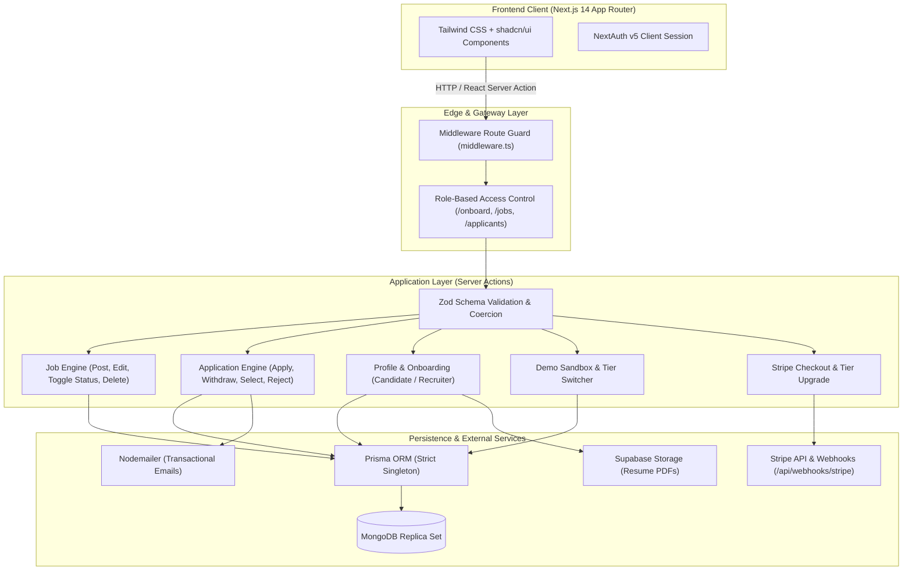
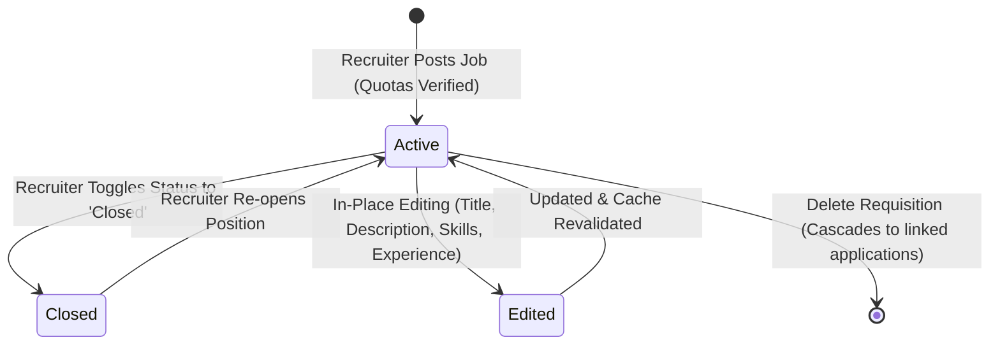
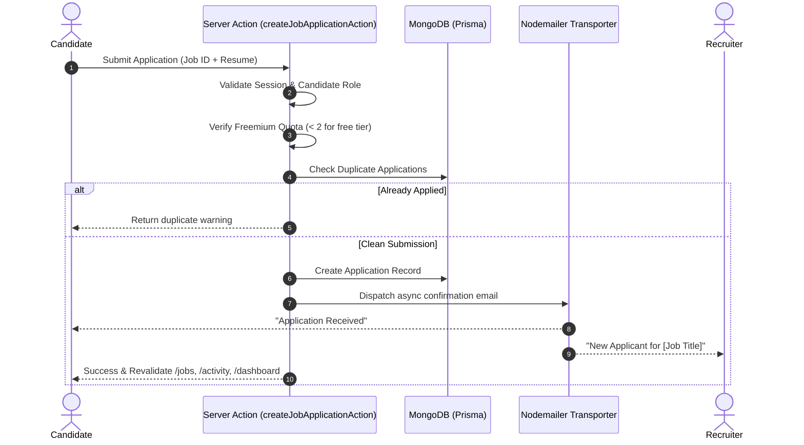

# HireHub
# HireHub — Modern Full-Stack ATS & Talent Marketplace

A full-stack job board connecting **recruiters** and **candidates** — post jobs, apply, track applications, and manage memberships all in one place.
[](https://nextjs.org/)
[](https://www.typescriptlang.org/)
[](https://www.prisma.io/)
[](https://www.mongodb.com/)
[](https://tailwindcss.com/)
[](https://authjs.dev/)
[](https://stripe.com/)
[](https://vitest.dev/)
[](https://github.com/)

**HireHub** is an enterprise-grade Applicant Tracking System (ATS) and talent marketplace built with **Next.js 14 App Router**, **TypeScript**, **Server Actions**, **Prisma ORM**, and **MongoDB**. It bridges the gap between hiring managers and engineering talent with end-to-end applicant tracking, real-time status management, resume ingestion, bookmarked roles, transactional notifications, and Stripe-powered freemium subscription quotas.

---

## ⚡ Quick Demo Logins & Interactive Sandbox

HireHub features **1-click ephemeral sandboxes** that allow instant exploration without manually typing credentials or risking multi-tenant test collisions:

- **1-Click Demo Recruiter**: On `/login`, click **Demo Recruiter** to launch a private hiring manager persona at Stripe with pre-loaded applicants across stages, requisitions, and 1 remaining free quota slot to test live job creation.
- **1-Click Demo Candidate**: Click **Demo Candidate** to launch a verified engineering profile with 1 pre-submitted application, 1 bookmarked role, and 1 available application slot to test live apply.
- **Instant Enterprise Quota Toggle**: On `/membership`, demo accounts feature a 1-click toggle between **Free Tier** (quota testing: max 2 jobs/applications) and **Enterprise Tier** (unlimited) without entering payment details.
- **Serverless Auto-Seeding Endpoint**: Hit `/api/seed` in any browser or curl to idempotently populate the 12 curated baseline engineering positions without shell access.

For manual sign-in on seeded staging or local environments:

| Role | Email | Password | Access Capabilities |
|---|---|---|---|
| **Recruiter** | `recruiter@test.com` | `password123` | Post & edit jobs, toggle Active/Closed, review applicants, download resumes, advance candidates, talent directory |
| **Candidate** | `candidate@test.com` | `password123` | Browse roles, search & filter, bookmark/save jobs, 1-click apply with resume, application timeline |

---

## 🛠️ Tech Stack

| Layer | Technology |
|---|---|
| Framework | Next.js 14 (App Router, Server Actions) |
| Language | TypeScript (Strict Mode) |
| Styling | Tailwind CSS + shadcn/ui |
| Database | MongoDB via Prisma ORM |
| Auth | NextAuth v5 (Credentials + GitHub + Google OAuth) |
| File Storage | Supabase Storage (resume PDFs) |
| Payments | Stripe Checkout + Webhooks |
| Validation | Zod |
| Testing | Vitest (55 tests across 9 suites) |
| Containerisation | Docker + Docker Compose |

---

## ✨ Core Features

### Candidates
- Register / sign in with credentials, OAuth (GitHub, Google), or 1-click demo sandbox
- Complete onboarding profile with resume PDF upload
- Browse all job listings with keyword search and filters (company, title, type, location)
- 1-click job bookmarking / saving with dedicated "Saved Jobs" filter tab
- Apply to jobs with freemium quota guards (max 2 applications on free tier)
- Real-time application timeline tracking (Applied → Selected / Rejected) in Activity
- Personal dashboard with application stats and recent status updates

### Recruiters
- Complete recruiter onboarding profile with company affiliation
- Post new jobs with freemium quota checks (max 2 active jobs on free tier)
- In-place job editing for title, description, skills, location, type, and experience
- Job status lifecycle management (toggle between `Active` and `Closed`)
- Delete requisitions with cascading deletion of linked applications
- Comprehensive applicant pipeline per requisition with resume previews and status actions
- Recruiter analytics dashboard and automated company directory

### Platform & Architecture
- Freemium membership tiers (Basic / Teams / Enterprise) with Stripe Checkout & webhooks
- Ephemeral demo sandbox architecture with automatic 24-hour background garbage collection
- Serverless auto-seeding route (`/api/seed`) for zero-CLI deployment initialization
- Dark mode throughout and mobile-first responsive layout
- Strict TypeScript domain modeling (`types/index.ts`) eliminating loose `: any` typings

---

## 🏗️ System Architecture



---

## 🔄 Core Workflows & Lifecycles

### 1. Job Opening Lifecycle (Recruiters)

Recruiters have full administrative lifecycle control over their job requisitions:



- **Active**: Discoverable on `/jobs` search, open for candidate applications.
- **Closed**: Labeled with a distinct `Closed` badge; candidate apply buttons are disabled to prevent stale applications.
- **Edit Modal**: In-place modification of title, location, type, experience requirements, description, and required skill tags with ownership authorization.

### 2. Candidate Application Pipeline



---

## 🚀 Key Feature Matrix

### 👔 Recruiter Workspace
- **Requisition Management**: Post new job openings with rich metadata (experience level, employment type, location, skill tags).
- **In-Place Job Editing**: Edit active postings without losing applicant history.
- **Status Lifecycle Control**: Instantly toggle jobs between `Active` and `Closed`.
- **ATS Applicant Pipeline**: Filter applicants by job opening, inspect full candidate profiles, preview/download PDF resumes stored in Supabase, and advance candidates through status stages (`Applied` → `Selected` / `Rejected`).
- **Talent Discovery Directory**: Search and explore candidates with skill matching and direct profile cards.
- **Recruiter Analytics Dashboard**: Live metrics tracking total postings, active requisitions, candidate pipeline distribution, and recent applications.

### 💼 Candidate Experience
- **Smart Job Search & Filtering**: Multi-dimensional filtering across job titles, company names, employment types (Full-Time, Part-Time, Remote), and locations.
- **1-Click Bookmark / Saved Roles**: Star jobs to save them to a dedicated "Saved Jobs" tab with real-time UI state sync.
- **Structured Application Flow**: Apply with verified onboarding profile information and uploaded PDF resumes.
- **Freemium Quota Enforcement**: Free-tier candidate accounts can apply to up to 2 positions before needing a membership upgrade.
- **Candidate Activity Hub**: Real-time status tracker monitoring all applied roles and status transitions.

### 💳 Monetization & Infrastructure
- **Stripe Checkout Integration**: Seamless recurring subscription checkout for Basic, Teams, and Enterprise plans.
- **Automated Webhook Sync**: `/api/webhooks/stripe` handles `checkout.session.completed` events to automatically activate premium account status.
- **Role-Based Guards**: NextAuth v5 session middleware protecting candidate/recruiter routes and preventing cross-role access.
- **Centralized Domain Types**: Comprehensive TypeScript type definitions in `types/index.ts` with zero `: any` shortcuts.

---

## 🧪 Automated Testing Suite

HireHub includes comprehensive automated unit and integration tests powered by **Vitest**:

```bash
# Run Vitest test suite
npm test
```

### Test Coverage Highlights
- **`tests/actions/createJobApplicationAction.test.ts`**:
  - Unauthenticated & non-candidate access rejection.
  - Candidate ID spoofing prevention.
  - Duplicate application prevention for the same role.
  - Freemium 2-job quota enforcement for free-tier users.
  - Premium candidate bypass validation.
- **`tests/actions/postNewJobAction.test.ts`**:
  - Role guard validation (Recruiters only).
  - Recruiter ID session verification.
  - Freemium 2-job posting quota limit enforcement.
  - Premium recruiter posting allowance.
- **`tests/actions/editJobAction.test.ts`**:
  - Recruiter authorization verification.
  - Nonexistent job handling.
  - Recruiter ownership validation (prevent editing competitor jobs).
  - Data update accuracy & Next.js cache revalidation.
- **`tests/actions/toggleJobStatusAction.test.ts`**:
  - Recruiter authorization & ownership checks.
  - Active ↔ Closed status transitions.
- **`tests/actions/toggleSaveJobAction.test.ts`**:
  - Candidate role verification.
  - Bookmark & un-bookmark idempotency.

---

## 🛠️ Tech Stack & Directory Structure

```
.
├── actions/                  # Next.js Server Actions
├── .github/workflows/
│   └── ci.yml                     # GitHub Actions CI: lint, typecheck, test, build
├── actions/                       # Next.js Server Actions
│   ├── createJobApplicationAction.ts
│   ├── editJobAction.ts           # [NEW] Requisition edit engine
│   ├── toggleJobStatusAction.ts   # [NEW] Active / Closed status switcher
│   ├── toggleSaveJobAction.ts     # [NEW] Candidate saved jobs engine
│   ├── postNewJobAction.ts
│   ├── deleteJobAction.ts
│   ├── postNewJobAction.ts
│   ├── updateJobApplicationAction.ts
│   ├── updateProfile.ts
│   ├── getCandidateDetailsByIDAction.ts
│   ├── createStripePaymentAction.ts
│   ├── createPriceIdAction.ts
│   ├── dbActions.ts           # Onboarding profile creation
│   ├── getUser.ts
│   ├── login.ts / logout.ts / register.ts
├── data/
│   └── user.ts               # DB query helpers (jobs, applications, stats)
├── lib/
│   ├── db.ts                 # Prisma client singleton
│   ├── utils.ts              # cn(), form controls, constants
│   └── supabaseClient.ts
│   └── updateProfile.ts
├── prisma/
│   └── schema.prisma         # User, Jobs, Application, Account models
│   └── schema.prisma              # User, Jobs (status: Active/Closed), Application, Account
├── schema/
│   └── index.ts              # Zod schemas for all server actions
│   └── index.ts                   # Zod validation schemas
├── tests/
│   └── actions/                   # Vitest unit & integration test suite
├── types/
│   └── index.ts                   # Centralized domain TypeScript interfaces
├── src/app/
│   ├── (protected)/
│   │   └── (dashboard)/
│   │       ├── activity/     # Candidate activity tabs
│   │       ├── companies/    # Companies hiring page
│   │       ├── dashboard/    # Role-based dashboard (stats + recent activity)
│   │       ├── feed/         # Jobs feed (candidate) / applications feed (recruiter)
│   │       ├── jobs/         # Jobs listing + search + filter
│   │       └── membership/   # Stripe membership plans
│   ├── account/              # Edit profile
│   ├── onboard/              # Role selection + profile setup
│   ├── login/ register/      # Auth pages
│   └── api/
│       ├── auth/[...nextauth]/
│       └── webhooks/stripe/  # Stripe webhook → membership update
├── auth.ts                   # NextAuth config (JWT strategy, OAuth, Credentials)
├── middleware.ts             # Route guards based on role
└── routes.ts                 # Public / auth / onboarding route lists
│   │       ├── activity/          # Candidate application activity tracker
│   │       ├── applicants/        # Recruiter applicant review pipeline
│   │       ├── companies/         # Hiring companies overview
│   │       ├── dashboard/         # Role-tailored analytics dashboards
│   │       ├── feed/              # Role-specific activity feed
│   │       ├── jobs/              # Job listings + Saved Jobs tab + Search
│   │       ├── membership/        # Stripe pricing plans
│   │       └── talent/            # Recruiter talent discovery directory
│   ├── account/                   # User profile & resume management
│   ├── onboard/                   # Role selection & profile wizard
│   ├── login/ & register/         # Auth pages
│   └── api/webhooks/stripe/       # Stripe webhook listener
└── vitest.config.ts               # Vitest configuration & module path aliases
```

---

## Getting Started
## 💻 Getting Started Locally

### Prerequisites
### 1. Prerequisites
- **Node.js**: v20.x or higher
- **MongoDB**: MongoDB instance with replica set enabled (required for Prisma transactions)
- **Supabase**: Project with a bucket named `hirehub-bucket-public`
- **Stripe**: Stripe account for test keys

- Node.js 18+
- A running MongoDB instance **with replica set enabled** (required by Prisma for transactions)
- Supabase project with a storage bucket named `hirehub-bucket-public`
- Stripe account
- GitHub and/or Google OAuth app credentials
### 2. Installation

### 1. Clone & install

```bash
# Clone the repository
git clone https://github.com/your-username/hirehub.git
cd hirehub
npm install

# Install dependencies
npm install --legacy-peer-deps

# Generate Prisma Client
npx prisma generate
```

### 2. Configure environment variables
### 3. Environment Configuration

Copy the sample environment file:

```bash
cp sample.env .env.local
```

Fill in every value in `.env.local`:
Fill in your configuration keys in `.env.local`:

```env
NODE_ENV=development
NEXTAUTH_URL=http://localhost:3000
NEXTAUTH_SECRET=          # generate with: openssl rand -base64 32
NEXTAUTH_SECRET=your_nextauth_secret_key

# MongoDB (must run as a replica set)
DATABASE_URL=mongodb://localhost:27017/hirehub?replicaSet=rs0&directConnection=true
# MongoDB (Replica Set required for transactions)
DATABASE_URL=mongodb+srv://<username>:<password>@cluster0.mongodb.net/hirehub?retryWrites=true&w=majority

# GitHub OAuth
# OAuth Providers (Optional for local dev)
GITHUB_ID=
GITHUB_SECRET=

# Google OAuth
GOOGLE_CLIENT_ID=
GOOGLE_CLIENT_SECRET=

# Supabase
NEXT_PUBLIC_SUPABASE_URL=
NEXT_PUBLIC_SUPABASE_ANON_KEY=
# Supabase Storage
NEXT_PUBLIC_SUPABASE_URL=https://your-project.supabase.co
NEXT_PUBLIC_SUPABASE_ANON_KEY=your_supabase_anon_key

# Stripe
NEXT_PUBLIC_STRIPE_PUBLISHABLE_KEY=
STRIPE_SECRET_KEY=
STRIPE_WEBHOOK_SECRET=
# Stripe Payments
NEXT_PUBLIC_STRIPE_PUBLISHABLE_KEY=pk_test_...
STRIPE_SECRET_KEY=sk_test_...
STRIPE_WEBHOOK_SECRET=whsec_...
```

### 3. Push the Prisma schema
### 4. Database Initialization & Seeding

```bash
# Push schema to database
npx prisma db push

# Seed test recruiters, candidates, and job openings
npm run seed
```

### 4. Run the development server
### 5. Running Quality Checks

```bash
npm run dev
```
# Typecheck
npx tsc --noEmit

Open [http://localhost:3000](http://localhost:3000).
# Lint
npm run lint

---
# Automated Tests
npm test

## Running with Docker
# Production Build
npm run build
```

The included `docker-compose.yml` spins up the Next.js app and a MongoDB replica-set node together:
### 6. Start Development Server

```bash
docker compose up --build
npm run dev
```

The app will be available at [http://localhost:3000](http://localhost:3000).  
MongoDB is exposed on host port `27027`.
Navigate to [http://localhost:3000](http://localhost:3000).

> **Note:** On first boot the replica set needs to be initialised once:
> ```bash
> docker exec -it mongo mongosh --eval "rs.initiate()"
> ```

---

## Stripe Webhook (local development)
## 🐳 Docker Deployment

Use the Stripe CLI to forward events to the local webhook handler:
To spin up HireHub and a MongoDB replica set container with a single command:

```bash
stripe listen --forward-to localhost:3000/api/webhooks/stripe
docker compose up --build
```

Copy the printed webhook signing secret into `STRIPE_WEBHOOK_SECRET` in `.env.local`.
Access the application at [http://localhost:3000](http://localhost:3000).

---

## Environment Variables Reference
## 📄 License

| Variable | Description |
|---|---|
| `NEXTAUTH_URL` | Full URL of your deployment (e.g. `https://hirehub.vercel.app`) |
| `NEXTAUTH_SECRET` | Random secret for JWT signing |
| `DATABASE_URL` | MongoDB connection string (replica set required) |
| `GITHUB_ID / GITHUB_SECRET` | GitHub OAuth app credentials |
| `GOOGLE_CLIENT_ID / GOOGLE_CLIENT_SECRET` | Google OAuth app credentials |
| `NEXT_PUBLIC_SUPABASE_URL` | Supabase project URL |
| `NEXT_PUBLIC_SUPABASE_ANON_KEY` | Supabase public anon key |
| `NEXT_PUBLIC_STRIPE_PUBLISHABLE_KEY` | Stripe publishable key |
| `STRIPE_SECRET_KEY` | Stripe secret key |
| `STRIPE_WEBHOOK_SECRET` | Stripe webhook endpoint signing secret |

---

## License

MIT
Distributed under the MIT License. See `LICENSE` for details.
